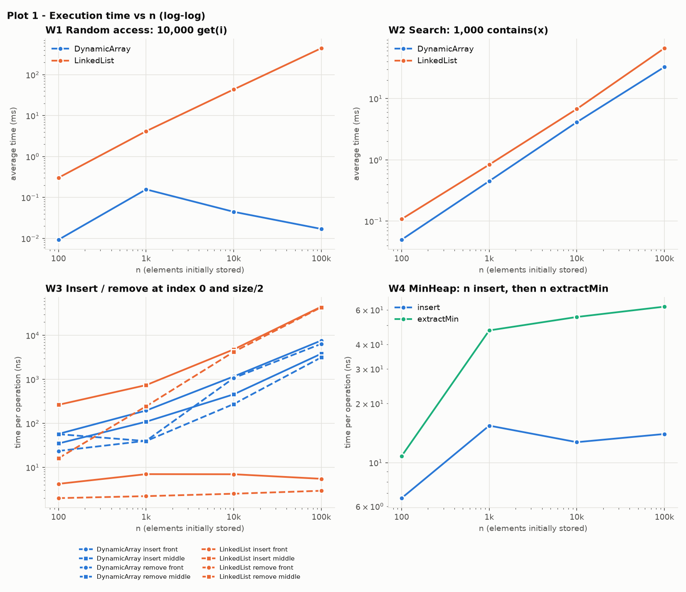
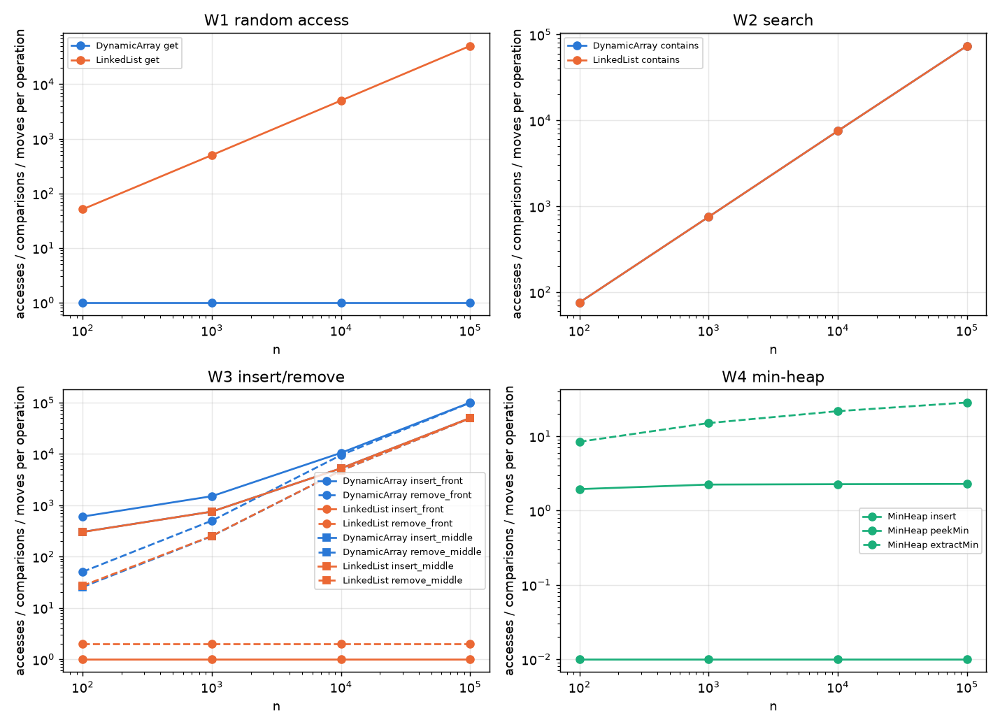
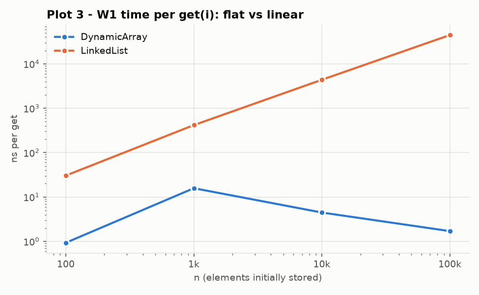
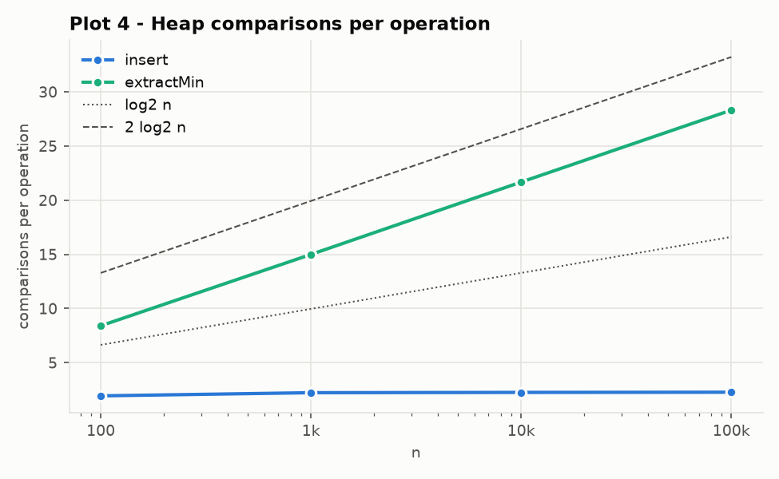

# Assignment 2: Algorithmic Analysis, Correctness and Performance Trade-offs

## Contents

1. [Overview](#1-overview)
2. [Complexity Analysis](#2-complexity-analysis)
3. [Correctness (loop invariants)](#3-correctness)
4. [Experimental Setup](#4-experimental-setup)
5. [Results](#5-results)
6. [Discussion](#6-discussion)
7. [Design Recommendations](#7-design-recommendations)
8. [Conclusion](#8-conclusion)

### Repository structure

```
assignment-2/
├── src/
│   ├── IndexedList.java     common interface of DynamicArray and LinkedList (+ counters)
│   ├── DynamicArray.java    resizable int array
│   ├── LinkedList.java      singly linked list with head and tail
│   ├── MinHeap.java         array-based binary min-heap
│   ├── Benchmark.java       the four workloads, writes CSV files
│   └── Tests.java           correctness tests (no external libraries)
├── scripts/
│   └── plot_results.py      builds plots and markdown tables from the CSV files
├── results/
│   ├── tables/              CSV output, summary.md, environment.txt
│   └── plots/               PNG plots
└── README.md
```

### How to build and run

Requires JDK 17+ (records and switch expressions are used) and Python 3 with matplotlib for the plots.

```bash
javac -d out src/*.java
java -cp out Tests                  # 26 test groups, exits with 1 if anything fails
java -Xmx2g -cp out Benchmark       # about 1 minute; writes results/tables/*.csv
python scripts/plot_results.py      # writes results/plots/*.png and results/tables/summary.md
```

---

## 1. Overview

This assignment implements three data structures from scratch (for `int` values), analyses them, and
tests the analysis against measurements:

| Structure | Physical organisation | Operations |
|---|---|---|
| `DynamicArray` | one contiguous `int[]`, capacity doubles when it is full | `add(x)`, `add(i,x)`, `remove(i)`, `get(i)`, `contains(x)` |
| `LinkedList` | singly linked nodes, `head` and `tail` references | same five operations |
| `MinHeap` | complete binary tree stored in an `int[]` (children of `i` are `2i+1`, `2i+2`) | `insert(x)`, `peekMin()`, `extractMin()` |

Every structure counts its own basic operations so the benchmark can report more than time:

* **accesses**: element reads/writes (array slots, or list nodes visited during a traversal);
* **comparisons**: element comparisons (`contains`, heap sift-up/sift-down);
* **moves**: elements shifted or copied (array), links rewritten (list).

The aim is to compare the asymptotic predictions (O, Ω, Θ) with measured behaviour and to explain the gaps,
which come from constant factors, the memory hierarchy and the JIT compiler.

---

## 2. Complexity Analysis

Notation: `n` is the current number of elements and `i` is the index argument. **O** is an upper bound,
**Ω** is a lower bound, and **Θ** means both hold (a tight bound). The "average" column assumes
the index is uniformly random in its valid range and, for searches, that the value is present at a
uniformly random position or absent.

### 2.1 Complexity table

| Structure | Operation | Best | Average | Worst | Auxiliary space |
|---|---|---|---|---|---|
| Dynamic Array | `add(x)` (append) | Θ(1) | Θ(1) amortized | Θ(n) (resize) | Θ(1) amortized; Θ(n) temporary array when resizing |
| Dynamic Array | `add(i, x)` | Θ(1) (`i = n`) | Θ(n) | Θ(n) (`i = 0`) | Θ(1) (Θ(n) if a resize happens) |
| Dynamic Array | `remove(i)` | Θ(1) (`i = n-1`) | Θ(n) | Θ(n) (`i = 0`) | Θ(1) |
| Dynamic Array | `get(i)` | Θ(1) | Θ(1) | Θ(1) | Θ(1) |
| Dynamic Array | `contains(x)` | Θ(1) (first slot) | Θ(n) | Θ(n) (absent) | Θ(1) |
| Linked List | `add(x)` (append) | Θ(1) | Θ(1) | Θ(1) (uses `tail`) | Θ(1) (one node) |
| Linked List | `add(i, x)` | Θ(1) (`i = 0` or `i = n`) | Θ(n) | Θ(n) (`i = n-1`) | Θ(1) (one node) |
| Linked List | `remove(i)` | Θ(1) (`i = 0`) | Θ(n) | Θ(n) (`i = n-1`) | Θ(1) |
| Linked List | `get(i)` | Θ(1) (`i = 0`) | Θ(n) | Θ(n) (`i = n-1`) | Θ(1) |
| Linked List | `contains(x)` | Θ(1) (head) | Θ(n) | Θ(n) (absent) | Θ(1) |
| Min-Heap | `insert(x)` | Θ(1) (`x ≥ parent`) | Θ(1) expected for random keys, O(log n) in general | Θ(log n) (new minimum) | Θ(1) amortized (resize as above) |
| Min-Heap | `peekMin()` | Θ(1) | Θ(1) | Θ(1) | Θ(1) |
| Min-Heap | `extractMin()` | Θ(1) (e.g. all keys equal) | Θ(log n) | Θ(log n) | Θ(1) |

Storage: all three structures use Θ(n) space overall. The array wastes up to half of its capacity
right after a doubling. A list node costs about 24 bytes in HotSpot (12-byte header, 4-byte `int`,
4-byte compressed reference, and padding), which is about **6 times** the 4 bytes per element that
`int[]` needs.

### 2.2 Justification

**Dynamic Array**

* `get(i)`: the address is `base + 4·i`, so one memory access is enough whatever `i` and `n` are. Θ(1) in all cases.
* `add(i, x)`: the loop copies `data[n-1], …, data[i]` one slot to the right, which is exactly `n − i`
  moves. For uniformly random `i`, the expected number of moves is `n/2`, which is Θ(n). With `i = n`
  nothing moves (Θ(1)); with `i = 0` all `n` elements move (Θ(n)).
* `remove(i)`: copies `data[i+1 … n-1]` one slot to the left, `n − i − 1` moves, and has the same cases.
* `add(x)`: Θ(1) unless the array is full. A resize copies all `n` elements, but because capacity
  doubles, resizes happen at sizes 8, 16, 32, …, so the total copying over `N` appends is
  `8 + 16 + … + N < 2N`. That gives **amortized Θ(1)** per append, even though one particular append costs Θ(n).
* `contains(x)`: a linear scan. If `x` is at position `k`, it takes `k+1` comparisons (best case 1). An
  absent `x` takes exactly `n` comparisons. A present `x` at a uniformly random position takes `(n+1)/2`
  on average. All of these except the best case are Θ(n).

**Linked List**

* `get(i)`: the only way to reach node `i` is to follow `i` `next` references from `head`, so it visits `i + 1` nodes. The
  average over random `i` is `(n+1)/2`, which is Θ(n). This is the key difference from the array: **both operations are called
  "get", but one computes an address and the other walks a chain.**
* `add(0, x)` / `remove(0)`: only `head` is relinked, which is Θ(1) and independent of `n`.
* `add(i, x)` / `remove(i)` in general: the actual relinking is Θ(1), but finding the predecessor (node `i−1`)
  takes Θ(i). So the cost is **Θ(i)** and the average is Θ(n). The list saves *moves* but pays in
  *traversal*. `add(x)` at the end is Θ(1) because of the `tail` reference. In contrast, `remove(n−1)` is Θ(n):
  a singly linked list cannot step backwards from `tail` to its predecessor.
* `contains(x)`: the same linear scan and the same comparison counts as the array.

**Min-Heap**

A heap with `n` elements is a complete binary tree of height `h = ⌊log₂ n⌋`.

* `peekMin()`: the heap property means the root is the minimum, so it returns `heap[0]`. Θ(1).
* `insert(x)`: `x` is placed in the first free leaf and sifted up. Each iteration costs one comparison and moves one level up, so there are
  at most `h` iterations, which is O(log n). The worst case (a new minimum travels all the way to the root) is Θ(log n). The best case
  is one comparison, Θ(1). With random keys, about half of all nodes are leaves and a new key usually stops
  after a level or two, so the **expected** cost is a small constant number of levels. The experiment measures about 2.3 comparisons per insert.
* `extractMin()`: the last leaf moves to the root and is sifted down. There are up to 2 comparisons per level and `h` levels,
  so it is O(log n). The moved leaf is usually one of the largest keys, so it almost always sinks close to the bottom.
  That makes the average Θ(log n) as well: at most `2·log₂ n` comparisons, and the measured count approaches `1.7·log₂ n`.
* Heap sort follows as a corollary: `n` inserts plus `n` extractions cost Θ(n log n) in total. This is what Workload 4 does.

### 2.3 Operations that look similar but have different costs

* **`get(i)` on an array vs. a list**: Θ(1) vs. Θ(n). They share a name and a signature, but they are very different algorithms.
* **Insert at the front vs. the middle**: for the array, the front is the *worst* case (`n` shifts) and the middle is `n/2`.
  For the list, the front is the *best* case (Θ(1)) and the middle is `n/2` hops. The same call can be cheap on one
  structure and expensive on the other.
* **Array insert in the middle vs. list insert in the middle**: both are Θ(n) with the same number of elementary steps
  (about `n/2`). However, the array steps are sequential memory copies that the JIT vectorizes, while the list steps are dependent pointer loads.
  The measured time differs by about 12× (Section 5.3).
* **`add(x)` on the array**: it is "Θ(1)" only amortized. One individual call can take Θ(n) when it triggers a resize.
* **`peekMin` vs. `extractMin`**: reading the minimum is free, but removing it forces the heap to be repaired along a root-to-leaf path.

---

## 3. Correctness

### Proof 1: `DynamicArray.add(index, x)` (shifting loop)

```java
ensureCapacity(size + 1);
for (int i = size; i > index; i--) {
    data[i] = data[i - 1];
}
data[index] = x;
size++;
```

Let `s` be the size before the call, and let `A[0..s-1]` be the original contents. The precondition is
`0 ≤ index ≤ s`. `ensureCapacity` guarantees `data.length ≥ s + 1` and copies `A` unchanged into the (possibly new) array,
so every write below stays in bounds.

**Loop invariant.** At the start of each iteration (each time `i > index` is tested), with `index ≤ i ≤ s`:

1. `data[0 .. index-1] = A[0 .. index-1]` (the prefix is untouched);
2. `data[index .. i-1] = A[index .. i-1]` (the part not yet shifted is still in place);
3. `data[i+1 .. s] = A[i .. s-1]` (the part already shifted is one slot to the right).

**Initialization.** Before the first test, `i = s`. No element has been modified, so (1) and (2) hold because the
array equals `A`. Part (3) covers the range `data[s+1 .. s]`, which is empty, so it holds trivially.

**Maintenance.** Suppose the invariant holds and `i > index`. The body executes `data[i] = data[i-1]`.
Because `index ≤ i−1 ≤ i−1`, part (2) says `data[i-1] = A[i-1]`, so afterwards `data[i] = A[i-1]`.
Together with (3), this gives `data[i .. s] = A[i-1 .. s-1]`, which is part (3) for `i−1`. The body wrote only position `i`,
which is outside `0 .. i-2`, so part (2) for `i−1` (`data[index .. i-2] = A[index .. i-2]`) and part (1) still hold.
After `i--`, the invariant holds for the new value of `i`.

**Termination.** `i` starts at `s ≥ index` and decreases by exactly 1 per iteration, so the loop stops after
`s − index` iterations with `i = index`. At that point part (2) covers the empty range, and the invariant gives

* `data[0 .. index-1] = A[0 .. index-1]`,
* `data[index+1 .. s] = A[index .. s-1]`.

**Why this proves correctness.** The statement after the loop sets `data[index] = x` and `size = s + 1`. So
`data[0 .. s] = A[0], …, A[index-1], x, A[index], …, A[s-1]`, which is exactly the original sequence with
`x` inserted at position `index`. No element is lost or duplicated. The loop runs from the right end towards `index`, so
each value is read before it is overwritten. A left-to-right loop would overwrite `A[index+1]` before it had been copied.
The number of iterations, `s − index`, also gives the Θ(n − index) cost used in Section 2.

### Proof 2: `MinHeap.insert(x)` (sift-up loop)

```java
heap[size] = x; size++;
int i = size - 1;
while (i > 0) {
    int parent = (i - 1) / 2;
    if (heap[parent] <= heap[i]) break;
    swap(i, parent);
    i = parent;
}
```

Write `p(j) = (j−1)/2` for the parent of `j`. Before the call, `heap[0..s-1]` is a valid heap `H`, meaning
`heap[p(j)] ≤ heap[j]` for all `0 < j < s`. We call the pair `(p(j), j)` an *edge*.

**Loop invariant.** Each time the condition `i > 0` is tested:

* **(I1)** `heap[0 .. s]` is a permutation of the multiset `H ∪ {x}`;
* **(I2)** every edge satisfies the heap order **except possibly the edge `(p(i), i)`**;
* **(I3)** if `i > 0`, then for every child `c` of `i`: `heap[p(i)] ≤ heap[c]` (the grandparent is not larger than
  `i`'s children).

**Initialization.** `i = s` and `x` sits in a new leaf. (I1) holds trivially. All edges except `(p(s), s)` are edges of
`H`, which is a valid heap, so (I2) holds. Node `s` is the last element, so it has no children and (I3) holds vacuously.

**Maintenance.** Assume the invariant and `i > 0`, and let `q = p(i)`.

* If `heap[q] ≤ heap[i]`, the loop exits via `break` (see termination).
* Otherwise let `a = heap[q]` and `b = heap[i]`, with `b < a`. After the swap, `heap[q] = b` and `heap[i] = a`. Check every edge that
  touches `q` or `i`:
  * edge `(q, i)`: `b < a`, OK;
  * edge `(i, c)` for a child `c` of `i`: we need `a ≤ heap[c]`, which is exactly (I3) before the swap, OK;
  * edge `(q, t)` for the sibling `t` of `i`: (I2) gave `a ≤ heap[t]` and `b < a`, so `b ≤ heap[t]`, OK;
  * edge `(p(q), q)`: this may now be violated. It is the one exception that (I2) allows for the new `i = q`.

  For (I3) with the new `i = q` (if `q > 0`): the children of `q` are `i`, which now holds `a`, and `t`. Before the swap,
  the edge `(p(q), q)` was not the exceptional edge, so `heap[p(q)] ≤ a`, and `a ≤ heap[t]`. So `heap[p(q)]`
  is ≤ both children of `q`, OK. A swap does not change the multiset, so (I1) holds. Setting `i = q` re-establishes the invariant.

**Termination.** Each iteration replaces `i` by `p(i) = (i−1)/2 < i`, so the depth of `i` drops by one. The
loop therefore stops after at most `⌊log₂(s+1)⌋` iterations, which is the O(log n) bound. It can stop in one of two ways:

* `i = 0`: node 0 has no parent edge, so by (I2) **every** edge satisfies the heap order;
* `break` because `heap[p(i)] ≤ heap[i]`: the only edge that (I2) left unchecked is now known to be fine, so again every edge holds.

**Why this proves correctness.** In both cases the array `heap[0..s]` satisfies the heap property on every edge (I2 plus the
exit condition), and by (I1) it contains exactly the old elements plus `x`. So after `insert` the structure is a valid
min-heap of the right elements, and `peekMin()` = `heap[0]` is its minimum.

*(`extractMin` uses the symmetric sift-down invariant: "the heap order holds everywhere except possibly between `i`
and its children". The proof follows the same pattern. The tests call `isValidHeap()` after every single
insert and extract.)*

---

## 4. Experimental Setup

| Parameter | Value |
|---|---|
| **n** (elements initially stored) | 100, 1,000, 10,000, 100,000 |
| **m** (operations per workload) | W1: 10,000 `get`; W2: 1,000 `contains`; W3: 1,000 insertions and `min(1000, n)` removals per position; W4: `n` inserts + `n` extractMins (+10,000 `peekMin`) |
| Repetitions | **5 timed runs**, and the **average** is reported |
| Warm-up | 3 untimed global rounds of all workloads for n ≤ 10,000, plus 1 untimed run before every experiment (JIT compilation) |
| Timing | `System.nanoTime()` immediately around the operation loop only |
| Random seed | `new Random(42)`, re-created for every (workload, n), so both structures get **identical** data |
| Values | uniform random integers in `[0, 1,000,000)` |
| Environment | OpenJDK 25.0.3 (JetBrains Runtime), HotSpot 64-bit Server VM, Windows 11 x64, 16 logical cores, `-Xmx2g` (see `results/tables/environment.txt`) |

Input data (values, indices, search keys, values to insert) is generated **before** each timed section,
and building the structure is also untimed. Nothing is printed inside a timed section. The results
of the measured operations are summed into a `blackhole` variable, which is printed at the end, so the JIT cannot delete
the measured loops as dead code.

**Workloads**

* **W1 Random access**: build a structure with `n` random ints, generate 10,000 indices uniformly in `[0, n−1]`, then call
  `get(index)` for each. Metric: element accesses (array slots read, or list nodes visited).
* **W2 Search**: 1,000 queries. Even-numbered queries use a value picked from the stored data (a successful search).
  Odd-numbered queries use a value from `[1,000,000, 2,000,000)`, which is guaranteed absent (an unsuccessful search that scans the whole structure). Metric:
  element comparisons.
* **W3 Insertion/removal**: (A) 1,000 × `add(index, x)`, then (B) a rebuild of the original structure from the same data and
  `min(1000, n)` × `remove(index)`, with `index = 0` and, in part (C), the middle. Metric: accesses + moves (array: shifted/copied
  elements plus the slot written; list: nodes traversed plus links rewritten).
* **W4 Priority processing**: an empty `MinHeap`, `n` inserts (timed), 10,000 `peekMin` (timed separately), and `n` extractMins
  (timed). Metric: comparisons. After each run, the extracted sequence is checked to be non-decreasing **and** identical to
  `Arrays.sort` of the input.

**Design decisions to note**

* *Removals with n = 100.* A structure with 100 elements cannot support 1,000 removals, so for removals `m = min(1000, n)`, which
  is 100 for n = 100. The tables report the `ns / op` and `per op` columns, which normalise for this.
* *Middle index.* The workload uses `index = size()/2` of the **current** structure. A fixed `n/2` would become an invalid index during the
  removal phase whenever `m > n/2` (for example n = 1,000). Using the current middle keeps the operation "in the middle" throughout.
* *Counter overhead.* The counting (`accesses++` and so on) stays enabled during timing. It adds the same kind of
  constant overhead to both structures, so it does not change the comparison.

---

## 5. Results

Full data: [`results/tables/all_results.csv`](results/tables/all_results.csv) (and one CSV per workload),
[`results/tables/summary.md`](results/tables/summary.md).

### Plot 1: Execution time vs. n



### Plot 2: Operations / comparisons / accesses vs. n



### Additional plots

| Time per `get(i)` | Heap comparisons per operation |
|---|---|
|  |  |

### 5.1 Workload 1: Random access (m = 10,000 `get`)

| n | Structure | Avg time (ms) | ns / get | Accesses | Accesses / get | Theory |
|---:|---|---:|---:|---:|---:|---|
| 100 | DynamicArray | 0.009 | 0.9 | 10,000 | 1.0 | Θ(1) |
| 1,000 | DynamicArray | 0.158 | 15.8 | 10,000 | 1.0 | Θ(1) |
| 10,000 | DynamicArray | 0.045 | 4.5 | 10,000 | 1.0 | Θ(1) |
| 100,000 | DynamicArray | 0.017 | 1.7 | 10,000 | 1.0 | Θ(1) |
| 100 | LinkedList | 0.304 | 30.4 | 511,327 | 51.1 | Θ(n) |
| 1,000 | LinkedList | 4.167 | 416.7 | 5,021,262 | 502.1 | Θ(n) |
| 10,000 | LinkedList | 43.786 | 4,378.6 | 50,188,951 | 5,018.9 | Θ(n) |
| 100,000 | LinkedList | 445.384 | 44,538.4 | 504,940,938 | 50,494.1 | Θ(n) |

**Analysis.** The array needs exactly 1 access per `get` for every n, and its time stays at a few
nanoseconds per call without any trend. The variation (0.9 to 15.8 ns, with the largest value at n = 1,000 and the smallest at
n = 100,000) is noise on totals of 9 to 158 µs, not growth. The list needs `≈ (n+1)/2` node visits per `get` (51, 502, 5,019, 50,494),
so its time grows **linearly**: each 10× increase in n gives about 10× more time (0.30 → 4.17 → 43.8 → 445 ms). At n = 100,000
the list is about **26,000× slower**. The experiment agrees with the theory: Θ(1) vs. Θ(n) per `get`, and Θ(m) vs. Θ(m·n) in total.

### 5.2 Workload 2: Search (m = 1,000 `contains`, 50% hits / 50% misses)

| n | Structure | Avg time (ms) | Comparisons | Comparisons / search | ns / comparison | Theory |
|---:|---|---:|---:|---:|---:|---|
| 100 | DynamicArray | 0.050 | 75,375 | 75.4 | 0.66 | Θ(n) |
| 1,000 | DynamicArray | 0.451 | 750,836 | 750.8 | 0.60 | Θ(n) |
| 10,000 | DynamicArray | 4.133 | 7,529,336 | 7,529.3 | 0.55 | Θ(n) |
| 100,000 | DynamicArray | 32.786 | 73,835,543 | 73,835.5 | 0.44 | Θ(n) |
| 100 | LinkedList | 0.108 | 75,375 | 75.4 | 1.44 | Θ(n) |
| 1,000 | LinkedList | 0.837 | 750,836 | 750.8 | 1.11 | Θ(n) |
| 10,000 | LinkedList | 6.775 | 7,529,336 | 7,529.3 | 0.90 | Θ(n) |
| 100,000 | LinkedList | 66.432 | 73,835,543 | 73,835.5 | 0.90 | Θ(n) |

**Analysis.** Both structures perform **exactly the same comparisons**, because the algorithm (a front-to-back scan) and the data are
identical. The expected count is `500·(n+1)/2 + 500·n ≈ 750·n`, which predicts 75,050, 750,500, 7.5 M and 75 M, and the
measurements match. The slightly lower value at n = 100,000 comes from duplicate values: with 10⁵ draws from a range of 10⁶, the
first copy of a searched value is often found earlier than its sampled position. Comparisons and time both grow linearly with
n (10× n gives about 8 to 10× time), which agrees with Θ(n). The *constant* differs: the array needs about 0.44 to 0.66 ns per
comparison and the list about 0.90 to 1.44 ns, so the array is **about 2× faster** (1.6 to 2.2×) at the same complexity (Section 6).

### 5.3 Workload 3: Insertion and removal

Time per operation (ns) and elementary steps (accesses + moves) per operation:

| n | Operation | DynamicArray ns/op | DynamicArray steps/op | LinkedList ns/op | LinkedList steps/op | Theory (array / list) |
|---:|---|---:|---:|---:|---:|---|
| 100 | insert front | 57.6 | 602.4 | 4.2 | 1.0 | Θ(n) / Θ(1) |
| 1,000 | insert front | 195.7 | 1,501.5 | 7.0 | 1.0 | Θ(n) / Θ(1) |
| 10,000 | insert front | 1,163.8 | 10,500.5 | 7.0 | 1.0 | Θ(n) / Θ(1) |
| 100,000 | insert front | 7,638.4 | 100,500.5 | 5.5 | 1.0 | Θ(n) / Θ(1) |
| 100 | remove front | 23.6 | 50.5 | 2.0 | 2.0 | Θ(n) / Θ(1) |
| 1,000 | remove front | 40.1 | 500.5 | 2.2 | 2.0 | Θ(n) / Θ(1) |
| 10,000 | remove front | 1,074.5 | 9,500.5 | 2.5 | 2.0 | Θ(n) / Θ(1) |
| 100,000 | remove front | 6,423.1 | 99,500.5 | 2.9 | 2.0 | Θ(n) / Θ(1) |
| 100 | insert middle | 34.9 | 302.9 | 264.2 | 301.5 | Θ(n) / Θ(n) |
| 1,000 | insert middle | 109.1 | 752.0 | 740.5 | 751.5 | Θ(n) / Θ(n) |
| 10,000 | insert middle | 456.9 | 5,251.0 | 4,790.2 | 5,251.5 | Θ(n) / Θ(n) |
| 100,000 | insert middle | 3,831.3 | 50,251.0 | 44,932.5 | 50,251.5 | Θ(n) / Θ(n) |
| 100 | remove middle | 56.8 | 25.5 | 16.2 | 27.0 | Θ(n) / Θ(n) |
| 1,000 | remove middle | 39.6 | 250.5 | 244.9 | 252.0 | Θ(n) / Θ(n) |
| 10,000 | remove middle | 275.0 | 4,750.5 | 4,225.3 | 4,752.0 | Θ(n) / Θ(n) |
| 100,000 | remove middle | 3,163.6 | 49,750.5 | 43,561.1 | 49,752.0 | Θ(n) / Θ(n) |

(For n = 100, removals use m = 100. The array's "insert" steps include resize copies. For example, at n = 100 the
count is 599,500 shifts + 1,000 writes + 1,920 elements copied by 4 doublings, which equals 602,420 exactly.)

**Analysis.**

* **Front.** The array must shift every element for every operation, so its steps per operation are about `n + 500` for inserts and about `n − 500` for
  removes, and the time grows linearly. The list only relinks `head`: exactly 1 step per insert and 2 per remove, and a
  constant 2 to 7 ns whatever n is. At n = 100,000 the list is about **1,400× faster** for inserts and about 2,200× faster for removes.
  This is the one workload where the list wins clearly.
* **Middle.** Both structures now perform ≈`n/2` elementary steps per operation. The counts are **almost identical** (50,251 vs.
  50,251.5), and both are Θ(n). The *time*, however, differs by about **12×** in favour of the array (3.8 µs vs. 44.9 µs at
  n = 100,000, and 3.2 µs vs. 43.6 µs for removal). The array's `n/2` steps are a sequential copy over contiguous memory, which the JIT turns into a SIMD loop
  (about 0.08 ns per moved element). The list's `n/2` steps are dependent pointer loads, and each load must finish before the next address is known
  (about 0.9 ns per node).
* **Physical organisation.** The array's cost depends on *how many elements lie after the position* (`n − i`), so
  the front is its worst case and the end is its best case. The list's cost depends on *how many nodes lie before the position* (`i`), so the
  front is its best case and anywhere else requires a walk. The list is only cheap if the caller already holds a reference to the neighbouring
  node, which this index-based interface never provides except at the head.

### 5.4 Workload 4: Priority processing (Min-Heap)

| n | insert: total ms | insert: ns/op | insert: comparisons (per op) | extractMin: total ms | extractMin: ns/op | extractMin: comparisons (per op) | log₂ n |
|---:|---:|---:|---:|---:|---:|---:|---:|
| 100 | 0.001 | 6.6 | 194 (1.9) | 0.001 | 10.8 | 841 (8.4) | 6.6 |
| 1,000 | 0.015 | 15.4 | 2,232 (2.2) | 0.047 | 47.1 | 14,994 (15.0) | 10.0 |
| 10,000 | 0.127 | 12.7 | 22,593 (2.3) | 0.552 | 55.2 | 216,736 (21.7) | 13.3 |
| 100,000 | 1.400 | 14.0 | 227,662 (2.3) | 6.230 | 62.3 | 2,831,463 (28.3) | 16.6 |

`peekMin` (10,000 calls) took between 0.0 and 2.0 ns per call and made 0 comparisons for every n. That is below the useful resolution of
`System.nanoTime()` and is consistent with Θ(1). For every n, all `n` extracted values were verified to be in non-decreasing order and equal to the sorted input.

**Analysis.**

* **insert**: the bound is O(log n) in the worst case. On random data the measured number of comparisons is a **constant ≈2.3 per insert**, because a random new key
  rarely climbs more than one or two levels. Time per insert stays around 7 to 15 ns. This agrees with the theory: O(log n) is an upper bound,
  and the expected cost for random input is Θ(1).
* **peekMin**: Θ(1). It reads `heap[0]` and nothing else.
* **extractMin**: comparisons per operation grow by a constant amount of about 6.6 for each 10× increase in n (8.4 → 15.0 → 21.7 → 28.3). That is the
  signature of a logarithm (Plot 4), and the ratio to `log₂ n` rises towards about 1.7 (1.27, 1.50, 1.63, 1.70), staying under the `2·log₂ n` worst-case bound. Total comparisons for
  n extractions grow as n log n (Plot 2). So the count of operations matches Θ(log n) per extractMin and Θ(n log n) in total.
* Time per extractMin grows faster than log n (10.8 → 62.3 ns, about 5.8× for a 2.5× increase in log₂ n). The n = 100 value
  is measured on a 1 µs total and is mostly noise. Beyond that, at larger n the heap array (400 KB at n = 100,000) is larger than the L1/L2 caches of
  typical CPUs, so the lower levels of each sift-down path cause cache misses. The *comparison count* follows the theory exactly; the *time*
  also includes memory-hierarchy costs that the RAM model ignores.

---

## 6. Discussion

**1. How does increasing n affect each workload?**
W1: array time is flat, while list time grows linearly (×10 per ×10 n). W2: both grow linearly, with an identical number of comparisons. W3 front:
array linear, list constant. W3 middle: both linear, array about 12× faster. W4: insert time is nearly constant per operation, and extractMin grows
logarithmically per operation (n log n in total).

**2. Which results agree with the theory?**
All the *operation counts* agree with the analysis almost exactly: 1 access vs. `(n+1)/2` for `get`, `≈750·n` comparisons in W2,
`n − i` shifts vs. `i` hops in W3, constant list front operations, and `≈1.7 log₂ n` comparisons per extractMin. The time curves also
have the predicted slopes on the log-log plots (slope 0 for Θ(1), slope 1 for Θ(n)).

**3. Where do the experimental results differ from the prediction?**
* For small n, the times are microseconds and are dominated by noise, timer resolution and JIT effects. For example, the array `get` at n = 1,000
  (15.8 ns) is "slower" than at n = 100,000 (1.7 ns), and `peekMin` measured 0.0 ns. Theory describes growth, not microsecond jitter.
* Array `remove_middle` at n = 100 costs 56.8 ns per operation, more than at n = 1,000 (39.6 ns), even though it performs 10× fewer moves.
  Its whole measurement is about 6 µs, so fixed per-call overheads and timer resolution dominate.
* Heap insert is O(log n) in theory but constant in practice on random data. The bound is not wrong; it is a worst case.
* extractMin time grows faster than log n because of cache misses, which the RAM model does not include.
* The linked list traversal costs about 0.9 ns per node here, which is fast for pointer chasing. The nodes were allocated one after another, so the
  JVM placed them almost contiguously and the hardware prefetcher helps. In a long-running program with a fragmented heap,
  each hop could miss the cache (≈50 to 100 ns), which would make the list far slower than measured here.

**4. Why can two algorithms with the same Big-O have different running times?**
Big-O hides constant factors and lower-order terms, and it counts abstract steps as if every step cost the same. W3 middle is the
clearest example: the array and the list perform *the same number* of elementary steps (about 50,251 per operation at n = 100,000), both Θ(n),
but the array is about 12× faster. W2 shows the same effect at about 2×.

**5. How do constant factors and implementation details affect performance?**
* *Memory layout*: contiguous `int[]` vs. separate 24-byte node objects. The array loads 16 ints per 64-byte cache line, while the list
  loads roughly 2 to 3 nodes per line and must follow a pointer to reach each one.
* *Data dependence*: in a list scan, the next address is known only after the current load completes, so the CPU cannot overlap loads.
  An array scan has independent, predictable addresses, which allows out-of-order execution and prefetching.
* *Vectorization*: HotSpot compiles the array shift loop into SIMD instructions (≈0.08 ns per element).
  No equivalent optimization exists for pointer chasing.
* *Allocation*: every list insertion allocates a node (GC pressure), while the array allocates only when it resizes.
* *JIT warm-up and measurement*: without the warm-up phase, the first configurations measured interpreted code and were up to 30×
  slower. The first benchmark version showed this, which is why the warm-up rounds were added.

**6. Why is a Dynamic Array preferable for some workloads?**
It has Θ(1) random access (W1: about 26,000× faster at n = 100,000), amortized Θ(1) append, cache-friendly scans (W2: about 2× faster), fast
vectorized shifting (W3 middle: about 12× faster than the list, even though both are Θ(n)), and about 6× less memory per element.

**7. When can a Linked List be useful?**
When most insertions and deletions happen **at the front** (a stack, or a queue with a `tail` pointer), W3 front shows Θ(1) with no
shifting: about 5 ns vs. 7.6 µs at n = 100,000. More generally, a list is useful when the caller already holds a node reference (iterators,
LRU caches, splicing lists together) and never needs indexed access, or when an individual operation must never cause a Θ(n) resize pause.

**8. Why is a Heap appropriate for priority-based processing?**
Priority processing needs "give me the smallest" repeatedly while new items arrive. A heap offers Θ(1) `peekMin`, O(log n)
`insert` (≈2 comparisons on random data) and Θ(log n) `extractMin`. With a sorted array, insert would be Θ(n) because of shifting. With an unsorted array or
list, extractMin would be Θ(n) because of scanning. For n = 100,000 in W4, a full insert-then-drain cycle took about 7.6 ms. A structure that scans for the minimum
would need about n²/2 = 5·10⁹ comparisons. The heap is also array-based, so it keeps the cache advantages of Section 6.5.

**9. How does the workload influence the choice of data structure?**
The choice depends on which operations dominate and *where* they happen. The same `add(index, x)` call is the list's best case at
index 0 and the array's worst case. Random access, iteration and memory efficiency favour the array. Front-only updates favour the list.
Repeated minimum extraction favours the heap. A complexity table alone is not enough, because for W3 middle it predicts a tie
while the measurements show a 12× difference.

---

## 7. Design Recommendations

| Workload | Recommended | Why (theory + measurement) |
|---|---|---|
| W1 Random access by index | **Dynamic Array** | Θ(1) vs. Θ(n). Measured 1.7 ns vs. 45 µs per `get` at n = 100,000 |
| W2 Membership search (unsorted) | **Dynamic Array** | Both Θ(n) with equal comparisons, but the array is about 2× faster because of cache locality. If searching is frequent, a hash set (Θ(1) expected) or a sorted array with binary search (Θ(log n)) would be better than either structure |
| W3 Insert/remove at the front | **Linked List** | Θ(1) vs. Θ(n). Measured about 3 to 6 ns vs. 6 to 8 µs per operation at n = 100,000 |
| W3 Insert/remove in the middle (by index) | **Dynamic Array** | Both Θ(n) with equal step counts, but the array's shifting is about 12× faster than the list's traversal |
| W4 Priority processing | **Min-Heap** | Θ(1) peek, O(log n) insert and extract. Handled 100,000 items in about 7.6 ms, with order verified |
| Mixed / unknown workload | **Dynamic Array** by default | Wins or ties in every measured case except front insertion and removal |

---

## 8. Conclusion

* All three structures were implemented from scratch and validated with 26 test groups. These cover empty, single-element, duplicate,
  boundary, invalid-index and 100,000-element cases, and include randomized differential testing against `ArrayList`, `java.util.LinkedList` and
  `PriorityQueue` (20,000 random operations each). The heap property was checked after every heap operation.
* Loop-invariant proofs were given for `DynamicArray.add(index, x)` and `MinHeap.insert(x)`.
* The operation counts from the experiments match the asymptotic analysis closely: Θ(1) vs. Θ(n) `get`, `≈750n` comparisons for search,
  `n − i` shifts vs. `i` hops, and `≈1.7 log₂ n` comparisons per extractMin.
* Running time follows the same growth rates, but **constant factors matter a great deal**. With the same Θ(n) and the same number of steps, the contiguous
  array beat the linked list by 2 to 12× because of cache locality, independent loads and SIMD. The linked list is only preferable when the work is
  concentrated at the head. For priority-based processing, the binary heap gives logarithmic operations and fast minimum access.
* Big-O tells us how the cost *scales*. Deciding which structure is faster at a given n also takes measurement and knowledge of the memory hierarchy.
